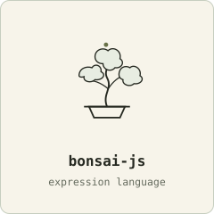
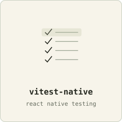
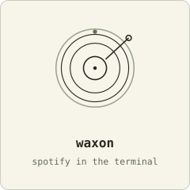
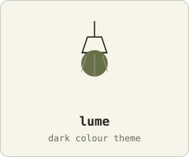
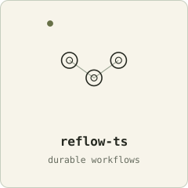
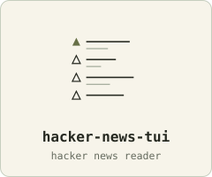
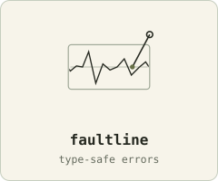
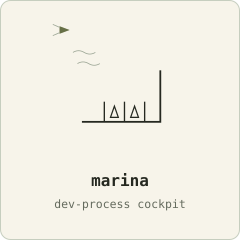
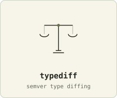
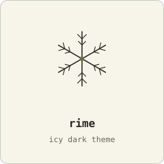

<strong>VP Lead Software Engineer @ JPMorganChase</strong> · London

<a href="https://github.com/danfry1/bonsai-js"><picture><source media="(prefers-color-scheme: dark)" srcset="machines/bonsai-js-dark.svg"></picture></a>
<a href="https://github.com/danfry1/vitest-native"><picture><source media="(prefers-color-scheme: dark)" srcset="machines/vitest-native-dark.svg"></picture></a>
<a href="https://github.com/danfry1/waxon"><picture><source media="(prefers-color-scheme: dark)" srcset="machines/waxon-dark.svg"></picture></a>
<a href="https://github.com/danfry1/lume"><picture><source media="(prefers-color-scheme: dark)" srcset="machines/lume-dark.svg"></picture></a>
 
<a href="https://github.com/danfry1/reflow-ts"><picture><source media="(prefers-color-scheme: dark)" srcset="machines/reflow-ts-dark.svg"></picture></a>
<a href="https://github.com/danfry1/hacker-news-tui"><picture><source media="(prefers-color-scheme: dark)" srcset="machines/hacker-news-tui-dark.svg"></picture></a>
<a href="https://github.com/danfry1/faultline"><picture><source media="(prefers-color-scheme: dark)" srcset="machines/faultline-dark.svg"></picture></a>
<a href="https://github.com/danfry1/marina"><picture><source media="(prefers-color-scheme: dark)" srcset="machines/marina-dark.svg"></picture></a>
 
<a href="https://github.com/danfry1/typediff"><picture><source media="(prefers-color-scheme: dark)" srcset="machines/typediff-dark.svg"></picture></a>
<a href="https://github.com/danfry1/wordle-tui"><picture><source media="(prefers-color-scheme: dark)" srcset="machines/wordle-tui-dark.svg"></picture></a>
<a href="https://github.com/danfry1/rime"><picture><source media="(prefers-color-scheme: dark)" srcset="machines/rime-dark.svg"></picture></a>
<a href="https://github.com/danfry1/mind-the-gap"><picture><source media="(prefers-color-scheme: dark)" srcset="machines/mind-the-gap-dark.svg"></picture></a>

Also: <a href="https://github.com/danfry1/astrotime">astrotime</a> · <a href="https://github.com/danfry1/bizdate">bizdate</a> · <a href="https://github.com/danfry1/canonjson">canonjson</a> · <a href="https://github.com/danfry1/chunkjson">chunkjson</a> · <a href="https://github.com/danfry1/theme-template">theme-template</a> · <a href="https://github.com/danfry1/jev-triage">jev-triage</a>

🌐 <a href="https://danfry.dev">danfry.dev</a> · 𝕏 <a href="https://x.com/danfrydev">@danfrydev</a>

